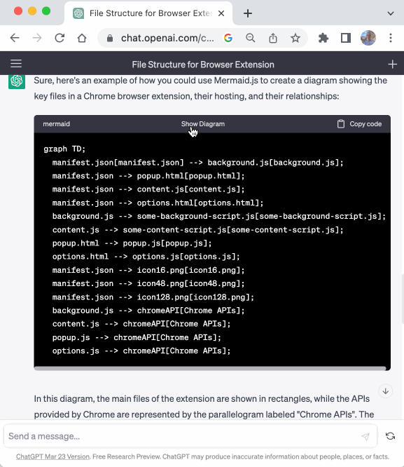
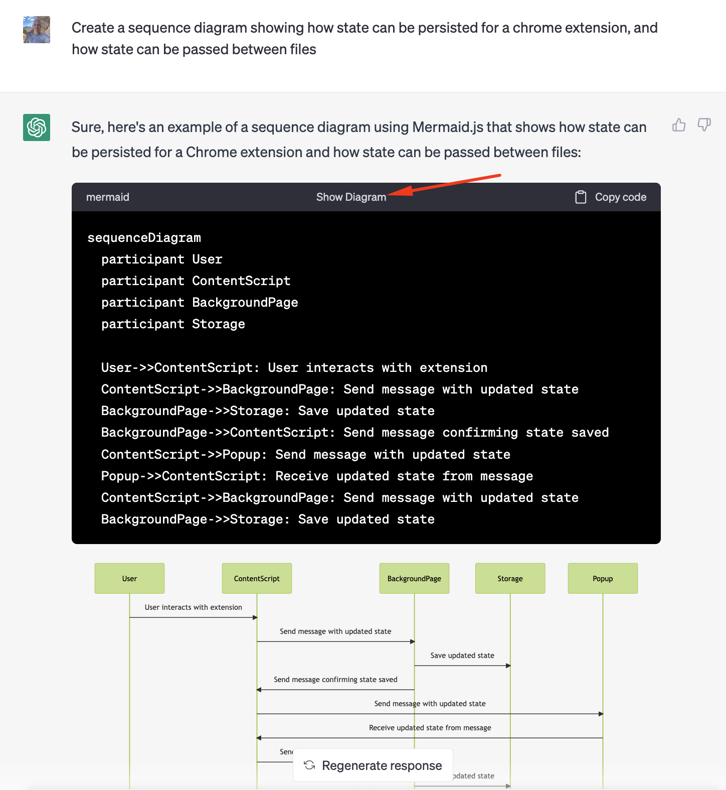

# chatgpt-diagrams

A Chrome browser extension that renders diagrams in the ChatGPT website inline:



<!-- vim-markdown-toc GFM -->

* [Quickstart](#quickstart)
* [Developer Guide](#developer-guide)
    * [Running the Sample Pages](#running-the-sample-pages)
    * [Manifest](#manifest)
    * [Debugging](#debugging)
    * [Verifying Pull Requests](#verifying-pull-requests)
* [Task List](#task-list)

<!-- vim-markdown-toc -->

## Quickstart

Clone, install dependencies and build the extension:

```bash
git clone git@github.com:dwmkerr/chatgpt-diagrams-extension.git
npm install
npm run build
```

Open [Chrome Extensions](chrome://extensions), choose 'Load Unpacked' and select the `./dist` folder. Now open https://chat.openai.com/ and enter a prompt such as:

> Use mermaid.js to create a sequence diagram showing how state can be persisted for a chrome extension, and how state can be passed between files.

Press the 'Show Diagram' button in the code sample to render the diagram inline:



## Developer Guide

[Node Version Manager](https://github.com/nvm-sh/nvm) is recommended to ensure that you are using the latest long-term support version of node.

Ensure you are using Node LTS, then install dependencies:

```bash
nvm use --lts
npm install
```

To run in local development mode, which will automatically reload when changes are made, use:

```bash
npm start
```

Load the unpacked extension in your browser from the `./dist` folder.

### Running the Sample Pages

The following command runs a local webserver, serving the content at [`./samples`](./samples). This makes it easy to test locally, without internet connectivity and without having to regularly log into ChatGPT:

```bash
make serve-samples
```

The sample page is served at `http://localhost:3000`.

### Manifest

Note that the `version` field is omitted from [`manifest.json`](./src/manifest.json). When fields like `version` are omitted, rollup copies them over from the `package.json` file.

### Debugging

There seems to be an issue with how the sourcemaps are generated by Rollup at the moment, meaning that regardless of how the [`output.sourcemap` option](https://rollupjs.org/configuration-options/#output-sourcemap) is specified, sourcemaps are not loaded by the browser.

### Verifying Pull Requests

To verify that the code builds, the tests pass and the release package can be created run the commands below:

```bash
make build
make test
make release
```

These commands will be executed for pull requests.

## Task List

A quick-and-dirty list of improvements and next steps:

- [ ] build: tests
- [ ] build: commitlint
- [ ] build: pipeline to create package
- [ ] build: release please
- [ ] docs: table of local commands
- [ ] bug: button is inserted multiple times while chatgpt is writing (add the class to the dom element _before_ start processing?)
- [ ] docs: table of libraries used
- [ ] feat: error handling
- [ ] feat: Create script to open a new chrome window, with the appropriate command line flags to load the dist unpacked
- [ ] feat: edit xpath queries via options page
- [ ] feat: counter for extension icon that shows number of diagrams processed
- [ ] feat: sample page rendering to speed up testing and local dev
- [ ] docs: blog post sharing extension, share online (LI, HN, Reddit)
- [ ] docs: better icon - just a simple 50/50 split of the two logos down the middle, or diagonal
- [ ] bug: debugger doesn't work on chrome, seems to be a sourcemaps issue (raised as https://github.com/crxjs/chrome-extension-tools/issues/691)
- [ ] feat: Lightbox for diagrams
- [ ] feat: 'copy' button for diagrams
- [ ] improvement: use the mutation observer (see ./src/observe.js) to watch for new code samples, rather than scanning the DOM on a timer
